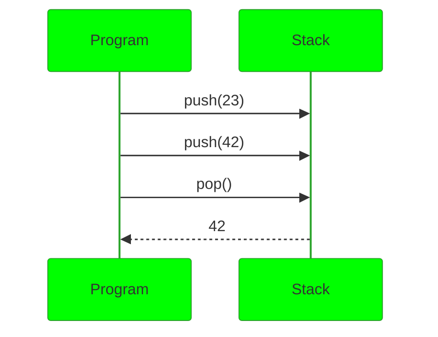

# Base

Stuff to be moved to [What’s the Story?](https://github.com/SchrodtSven/WhatsTheStory) l8er

## Stack

- *last in, first out*
- ```push``` onto
- ```pop``` off

All data stored on the *stack* </var>* **must have a known, fixed size**. Data with an unknown size at compile time or a size that might change must be stored on the *heap* instead.

### Stack operations



## Heap

- is less organized

The **memory allocator** finds an empty spot in the heap that is big enough, marks it as being in use, and *returns a pointer*, which is the address of that location.
This process is called allocating on the heap and is sometimes abbreviated as just allocating (pushing values onto the stack is not considered allocating).
Because the pointer to the heap is a known, fixed size, you can store the pointer on the stack, but when you want the actual data, you must follow the pointer.